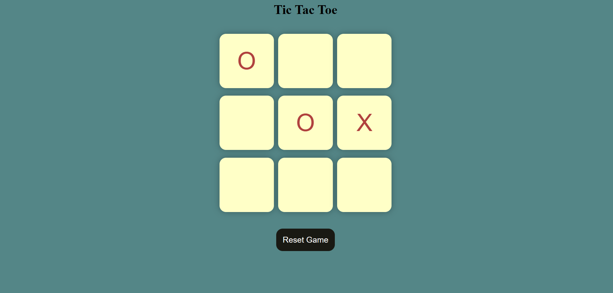

# Task 3 : Tic-Tac-Toe

This repository contain the third task of my internship at Prodigy Infotech company. 
## About:
For this task, i made a tic-tac-toe game using HTML,CSS and Javascript. 
By implementing functions to handle user clicks, track game state, and check for winning conditions, i have created an interactive tic-tac-toe game. With this technologies and functionalities, user can play Tic-Tac-Toe game with each other, aiming to get three markers in a row to win game.

## How to Run:
To run this, 
- Install code editors.(for eg: VSCode) from here: [VSCode](https://code.visualstudio.com/download)
- Clone above repository in any folder 
- open that folder in VSCode 
- run 'index.html' file in any browser
And you can play the tic-tac-toe game.

## Output Demo:

## Feedback

If you have any feedback, please reach out to me at yogendrabaskota18@gmail.com
